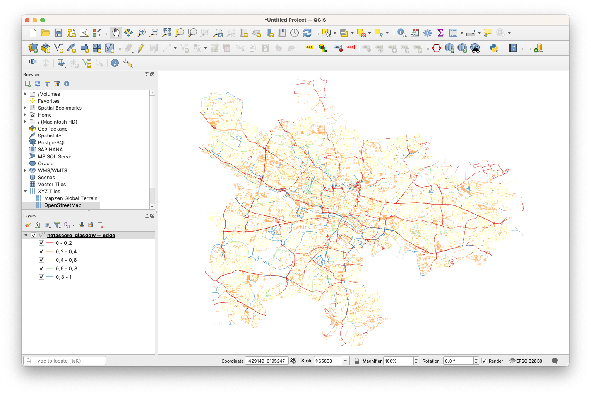

# Installing and running NetAScore
### Pre-requisites and Installation
To run NetAScore on your machine using the ready-made Docker image, you need to have [Docker](https://docs.docker.com/engine/install/) installed. Before you start with the Tutorial, make sure Docker is running and that you have a stable Internet connection.

As an alternative, you may run NetAScore outside of Docker in Python. However, this requires to have a PostgreSQL database set up and running, as well as having several commandline utilities and python packages installed. To follow this approach without using Docker, please find further instructions at the respective [NetAScore wiki page](https://github.com/plus-mobilitylab/netascore/wiki/Run-NetAScore-manually-with-Python).

### 1. Get the resources
After you installed Docker, you need to download the [`docker-compose.yml`](https://github.com/plus-mobilitylab/netascore/blob/main/examples/docker-compose.yml) as raw file from the `examples` in [https://github.com/plus-mobilitylab/netascore](https://github.com/plus-mobilitylab/netascore). Please save it to an empty directory. In this tutorial the directory is called `NetAScore`. 

Then, create a new subdirectory named `data` within the same folder, next to the `docker-compose.yml` file.
Proceed with downloading the settings file template from GitHub ([`examples/settings_osm_query.yml`](https://github.com/plus-mobilitylab/netascore/blob/main/examples/settings_osm_query.yml)), and save it to the `data` subdirectory. 
Lastly, you need to download the mode profiles for _bikeability_ ([`profile_bike.yml`](https://github.com/plus-mobilitylab/netascore/blob/main/examples/profile_bike.yml)) and _walkability_ ([`profile_walk.yml`](https://github.com/plus-mobilitylab/netascore/blob/main/examples/profile_walk.yml)) and save them to the `data` directory as well.


### 2. Let's adapt the settings file for an AOI of your choice
In order to run NetAScore for an area of interest of your choice, you need to adapt the *settings file* (`settings_osm_query.yml`). To do so, you first change the case_id and then specify the name of the place you want to run NetAScore for. In this example, we'll use "Glasgow City".

The `case_id` is located in the `global` section of the settings file and is a unique ID used to distinguish between different datasets (only alphanumeric characters are allowed). Choose e.g. `case_id: glasgow`.

The `place_name` is used to determine the area for which the OSM data is queried. It can be set in the `import`-section of the settings file. Make sure to only query reasonable amounts of data - e.g. city-scale. If you want to compute country-wide bikeability, please follow the instructions in section "[Using local OSM data as input: ideal for large areas](#Using local OSM data as input: ideal for large areas)".
For our Glasgow example, change the value of `place_name` to `Glasgow City`, which is the name registered in OpenStreetMap.


If you want to know more about the adjustments that can be made within the settings file, feel free to have a look at the [wiki page](https://github.com/plus-mobilitylab/netascore/wiki/Configuration-of-the-settings), that deals with further configuration of the settings.

### 3. Let's run Netascore!
Now we are ready to run NetAScore to compute bikeability and walkability for Glasgow.
First, open a terminal window and navigate to the parent folder you created, in our case `NetAScore`. This should contain the `docker-compose.yml` file. From here, enter the following command and hit enter:

```
docker compose run netascore data/settings_osm_query.yml
```

Docker will now start downloading the NetAScore image and the PostgreSQL database image, setup the environment and execute the workflow for your area of interest. The last argument represents the settings file to use. So if you want to try and compare different settings, feel free to duplicate your settings file and reference it here when calling docker compose.

When running NetAScore for the first time, the process might take a while, as all docker images need to be downloaded. It will be faster the next time.

Still, running the docker image might take a couple of minutes, as NetAScore first queries all required OpenStreetMap data using the Overpass API. It afterwards imports, processes and exports the final dataset. You can tell the run was completed successfully once the Database connection is closed, after both "edge" and "node" layers were exported. It should look similar to this:


You can now find the assessed network as a geopackge within the `data`-sub-folder you previously created. It includes _bikeability_ in columns `index_bike_ft` and `index_bike_tf` and _walkability_ in `index_walk_ft` and `index_walk_tf`. The extensions `ft` and `tf` refer to the direction along an edge: from-to or to-from node. These values represent the assessed suitability of a road segment for cycling (_bikeability_) and walking (_walkability_).

### 4. Let's visualise the results!
If you want to have a look at the results for segment-based bikeability and walkability, just follow the instructions in our [QGIS tutorial](03_NetAScore-QGIS.md).



### 5. Feel free to customize...

Now that you succeeded on running NetAScore for Glasgow City, maybe you want to compute bikeability and walkability for a different area of interest? Or are you interested in adjusting the model parameters for bikeability and walkability?

#### Choosing a different area of interest

To choose a different area of interest, simply replace the `place_name` in the settings file accordingly. Also, do not forget to change the `case_id`, otherwise your previous output file will be overwritten.

You might want to consider adding one of the additional query parameters to the `import` section:
* `interactive: True`: this setting allows you to choose from a list of features in case that your search term returned more than one matching geometry
* `admin_level`: filters the given results for OSM `admin_level` property (see [OSM documentation](https://wiki.openstreetmap.org/wiki/Item:Q1074))
* `zip_code`: filters the given results for a ZIP code (if available in OSM data)

Using these options, NetAScore directly downloads OpenStreetMap data via Overpass API. This is a convenient feature suitable for city- or regional scale. However, if you are interested in assessing larger spatial extents, please follow the instructions in the next section on how to use local OSM data input.

For further options, please read the detailed information on our Github [Wiki page](https://github.com/plus-mobilitylab/netascore/wiki/Configuration-of-the-settings#section-import).

*Please note: Network data is being queried based on the bounding box (rectangle) containing the polygon returned for the place name query. If you do not specify a reference system (global option `target_srid`), the UTM zone suitable for the centroid of the area of interest is used.*


#### Using local OSM data as input: ideal for large areas

You can also provide a **local OSM file** to NetAScore using the `filename` property instead of the `place_name` in `settings_osm_query.yml`. For our current workshop, you find an example for the City of Glasgow on the [shared web drive](https://heibox.uni-heidelberg.de/d/9f1c43601ad2475f843b/) (`glasgow-latest.osm.pbf`). OpenStreetMap exports are provided on different scales with global coverage e.g. by [Geofabrik](http://download.geofabrik.de).

This is how the `import` section of the settings file should look like for the Glasgow example:

```yaml
import:
  type: osm
  on_existing: delete
  filename: glasgow-latest.osm.pbf
```

If you use an OSM file as input, you currently have to specify the **target SRID** (spatial reference system) manually. To do so, please add the key `target_srid` with the respective EPSG code as value to the `global` section of the settings file. Please note: Only **metric reference systems** are currently supported and will generate valid results.

For the Glasgow example, the `global` section could read as follows:

```yaml
global:
  case_id: glasgow
  target_srid: 32630
```

#### Add optional data layers

If available for your area of interest, you can supply additional input layers to NetAScore for improving model results. The main options for extension are:

- **DEM** (digital elevation model): It is used to determine gradient (slope) of road segments. By default, this input will be considered in both the bikeability and the walkability profile.
- **noise** (polygons of (traffic) noise classes): This input will be used for refining walkability assessment with the default mode profile.

Details on how to adapt the settings file for using these optional inputs are provided in the [NetAScore Wiki](https://github.com/plus-mobilitylab/netascore/wiki/Configuration-of-the-settings#section-optional).


#### Customise the walkability and bikeability profiles

As perception of infrastructure suitability for active mobility has strong individual and purpose-specific components, we allow easy access to customising *mode profile* definitions. You are invited to experiment with the **indicator weights** as well as with the **value mappings** per indicator. All of these definitions are contained in the *mode profile* files. The default profiles are:

- `profile_bike`
- `profile_walk`

Both default *mode profiles* should already be located in your `data` subdirectory of NetAScore by now. You also find them in the `examples` folder [on Github](https://github.com/plus-mobilitylab/netascore/tree/main/examples).

It is up to you whether you want to directly adjust the default profile files or work on local copies. In case of working on copies, just reference the newly created profile file from the settings file. In the example below, a new profile named "bike_child" is added, with its definition being stored in `profile_bike_child.yml`.

```yaml
profiles:
  -
    profile_name: bike
    filename: profile_bike.yml
    filter_access_bike: True
  -
    profile_name: bike_child
    filename: profile_bike_child.yml
    filter_access_bike: True
  -
    profile_name: walk
    filename: profile_walk.yml
    filter_access_walk: True
```

Details regarding how to reference mode profiles from the settings file are provided in the [Wiki](https://github.com/plus-mobilitylab/netascore/wiki/Configuration-of-the-settings#section-profiles).


## Mode profiles

The mode profile files are written in YAML and contain definitions of model parameters. The first part defines indicator weights, and the second part provides numeric value mappings for all indicator values. These files are contained in the `data` folder. 

To set an indicator to be ignored for index computation, its weight can be set to `NULL`.

The default mode profiles for bikeability and walkability can be found at `/examples/profile_bike.yml` and `/examples/profile_walk.yml`. Their definition looks like this:

```yaml
version: 1.1

weights:
  bicycle_infrastructure: 0.2
  pedestrian_infrastructure: NULL
  designated_route: 0.1
  road_category: 0.3
  max_speed: 0.1
  max_speed_greatest: NULL
  parking: 0.1
  pavement: 0.1
  width: NULL
  gradient: 0.1
  number_lanes: NULL
  facilities: NULL
  crossings: NULL
  buildings: NULL
  greenness: NULL
  water: NULL
  noise: NULL
```

In addition to indicator weights that are used to compute the index as weighted average, value overrides can be specified. Here, either the index can be set to a fixed value or indicator weights can be replaced. This allows to handle specific situations such as steep gradient in combination with gravel surface (as shown in the following example):

```yaml
overrides:
  - description: combination of gradient and pavement (steep and loose/rough)
    indicator: pavement
    output:
      type: weight
      for: [pavement, gradient]
    mapping: 
      "{gravel, soft, cobble}":  
        indicator: gradient
        mapping:
          "{-4, -3, 3, 4}": 1.6

```

The last section of a mode profile contains the value mappings per indicator. These represent individual contributions of specific indicator values - such as a specific type of cycling infrastructure - to infrastructure suitability.

Exemplary indicator value mapping:
```yaml
indicator_mapping:
  - indicator: bicycle_infrastructure
    mapping:
      "bicycle_way": 1
      "mixed_way": 0.9
      "bicycle_lane": 0.75
      "bus_lane": 0.75
      "shared_lane": 0.5
      "undefined": 0.2
      "no": 0
```