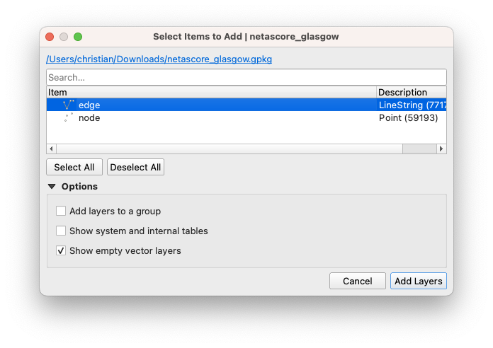
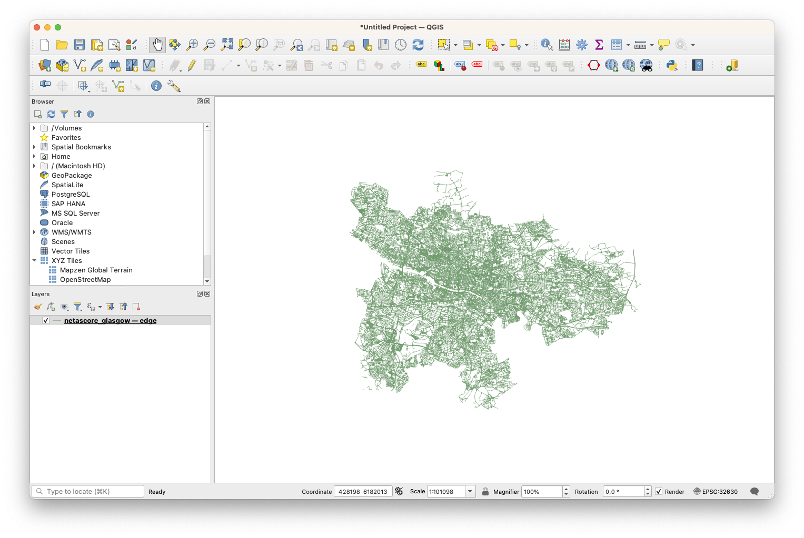
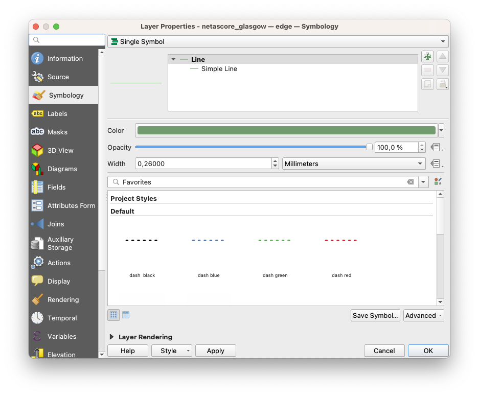
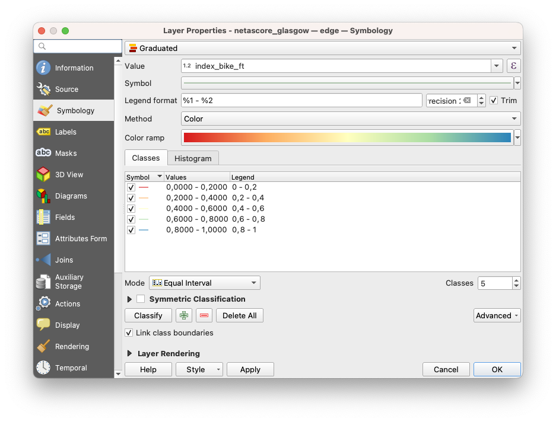
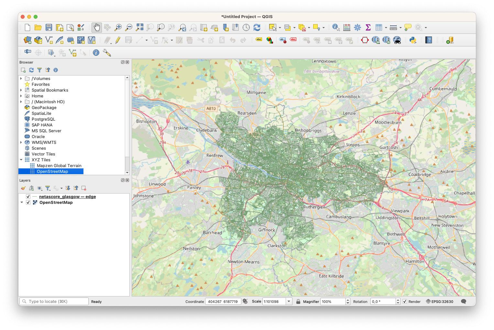

# NetAScore Visualisation in QGIS

## Visualising bikeability and walkability in QGIS

In this part of the tutorial, we will visualise NetAScore results for the whole City of Glasgow. It is a typical first step after computing segment-based bikeability and walkability, allowing for exploratory, visual analytics of an area of interest.

### Required resources

For this tutorial it is sufficient to have a NetAScore output file at hand. You may use one of the readily computed examples from [doi.org/10.5281/zenodo.10886962](https://doi.org/10.5281/zenodo.10886962).

If you do not have installed QGIS yet, please follow the [installation instructions](https://qgis.org/en/site/forusers/download.html).

### Load the NetAScore data into QGIS

To load the NetAScore data, simply open QGIS and drag and drop the `netascore_salzburg.gpkg` (or whatever local output you want to visualize) from your file browser into the main QGIS window. As an alternative, you may create a new project first and then select and double-click the file from the "Browser" panel.

QGIS will ask you about which layer(s) to add. For visualising segment-based bikeability and walkability, adding the "edge" layer is sufficient. To do so, simply click on the layer name to select it,  and then press "Add Layers".

After import, your QGIS window should look similar to the one shown below. All segments of the imported network have the same colour and line style. Therefore, we will add a style definition to visualise bikeability or walkability values in the next step.

### Create a symbology for bikeability

For colouring segments according to their bikeability or walkability, we need to change the layer symbology. To do so, first double-click on the layer name in the "layer" panel. This will open the layer properties dialog. Then, in the navigation bar on the left, select "Symbology". It should look similar to the screenshot below.

Instead of the "Single Symbol" visualisation, we now want to use a "Graduated" style. Please select this option from the topmost dropdown field.

In the next step, we need to choose the column to use as input for graduated visualisation. For example, if you want to visualise bikeability, select the column "index_bike_ft" from the dropdown labeled "Value". This refers to the "bike" profile we used when running NetAScore, with "_ft" being the forward direction along each segment. 

Once the input values are defined, you can now choose a color ramp. With clicking on the small arrow next to the color ramp, you can choose from several presets. The "Spectral" preset is the one we applied in our example.
A good starting point for classification is to use "Equal Interval" mode with 5 classes. 
The following screenshot gives an overview of the parameters we applied:

As the bikeability and walkability index values range from 0 (unsuitable infrastructure) to 1 (very suitable infrastructure), make sure that the classification uses these as upper and lower bounds. For the example of Glasgow, this should be set automatically. If not, simply double-click the values shown in the "Values" column next to the coloured class symbols and edit the bounds manually.

After clicking "OK", your data should be visualized similar to the image below:

### Add a visualisation for walkability

If you want to add a visualisation for walkability as well, just right-click on the bikeability layer in the "Layers" panel and choose "Duplicate Layer". You may now want to give each layer an intuitive name - this can be done by right-clicking and selecting "Rename Layer". 

Then, for the layer that should represent walkability, open the layer properties by double-clicking the layer name. It should be sufficient to now select the column "index_walk_ft" as the "Value" instead of the bikeability index. After clicking on "OK", your layer should update accordingly.

You can toggle layer visibility using the checkbox next to layer names in the "Layer" panel.

### Add a basemap

To add a background map, you can either choose the default OSM tiles provided with QGIS, or use the "QuickMapServices" extension. For the default OSM tiles, double-click on "OpenStreetMap" within the "XYZ Tiles" section in the "Browser" panel (see screenshot for reference). The QuickMapServices also provide layers with a reduced color scheme - e.g. CartoDB Positron.

### Looking into index robustness

NetAScore currently allows basic tracking of index robustness. The columns `index_bike_ft_robustness`, `index_walk_ft_robustness`, etc. provide an indicator that represents the sum of weights for all indicators available per segment. 
For example, as the default profile includes gradient with a weight of 0.2 and we did not supply DEM data for the Glasgow example, the robustness value is reduced by 0.2. 
If you visualize the robustness column in QGIS, you will notice that consequently the maximum robustness for the whole area is 0.8. If relevant OSM attributes are missing and cannot be inferred from the context, the index robustness is further decreased. 